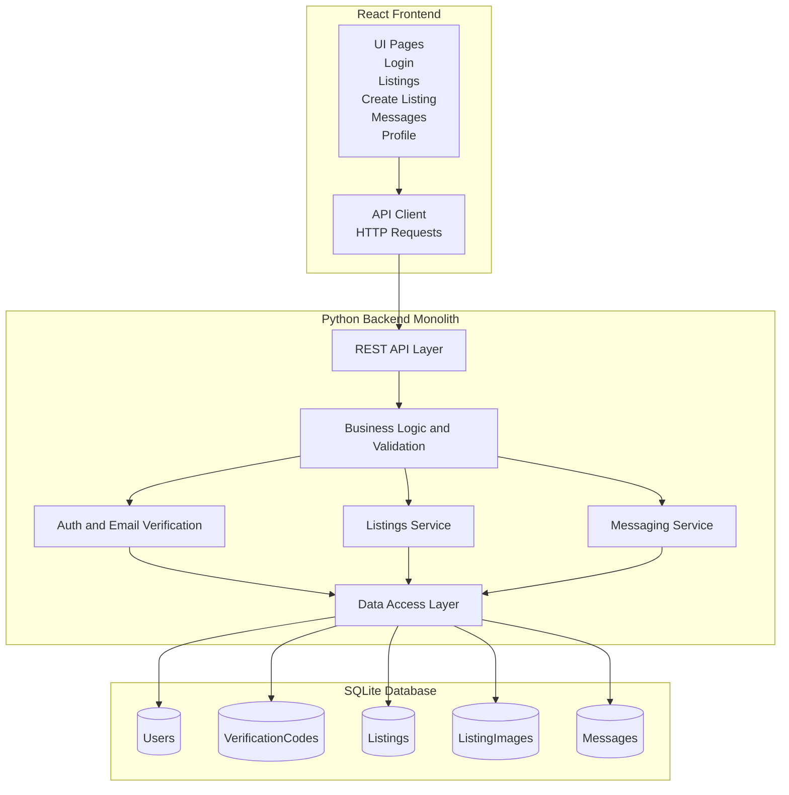
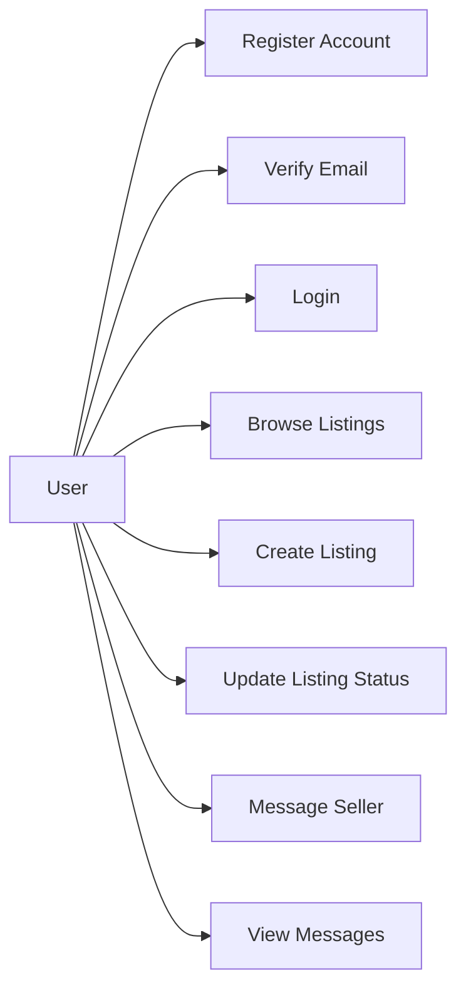
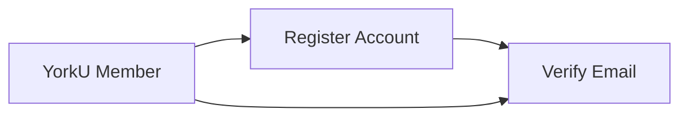
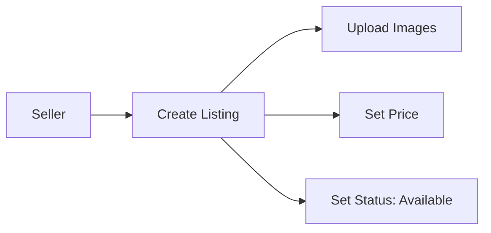
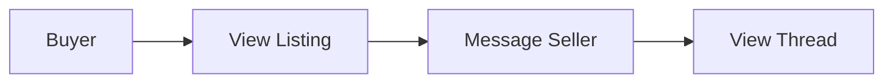
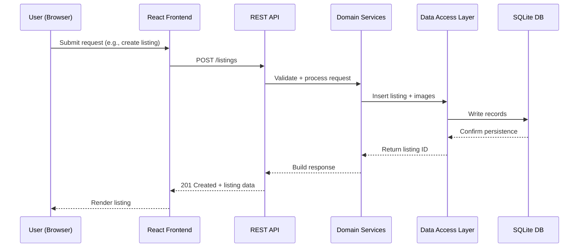
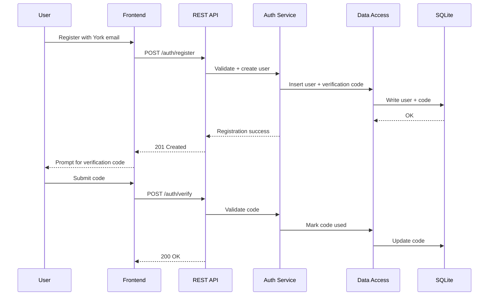
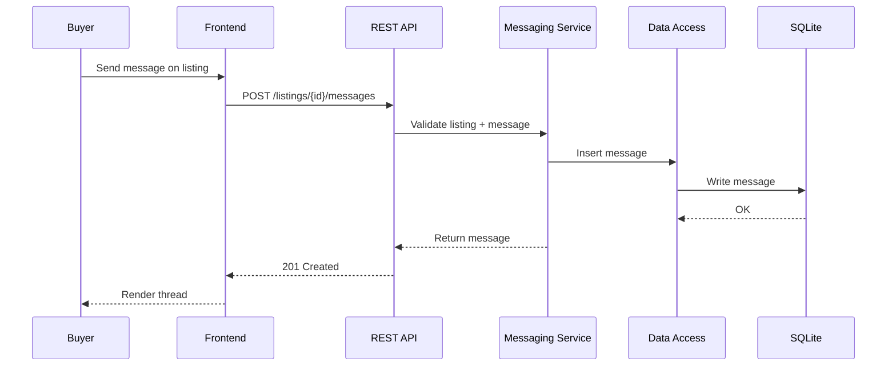

EECS4314  
Detailed Design & Implementation Plan  
Group 6  

Rajendra Brahmbhatt - 217925157  
Mai Komar - 218590935  
Harnaindeep Kaur - 217621137  
Michael Byalsky - 219026202  
Lakshan Kandeepan - 216440521  
Daniel Chahine - 219598994  

Authors: Rajendra Brahmbhatt, Mai Komar, Harnaindeep Kaur, Michael Byalsky, Lakshan Kandeepan, Daniel Chahine  
Contributors: Same as authors  
Last updated: February 11, 2026  
Status: Draft  

## Purpose
YU-Trade is an online marketplace designed specifically for current York University members (students, faculty, professors). Verified users can post items for sale, browse listings, and privately message sellers about specific products. Access is limited to York University emails (`@my.yorku.ca`, `@yorku.ca`) to improve safety and trust compared to open marketplaces.

## Background Reading
To understand the current market of digital consumer-to-consumer ecosystems, we looked at leading platforms. Facebook Marketplace has an estimated 491 million users, and Kijiji sees significant engagement with 14 million users every month. Following these models, our design prioritizes identity verification, trust, and search/filtering for a seamless user experience.  

References:
1. Capital One Shopping Research, "Facebook Marketplace Statistics."
2. Google Ad Manager, "Kijiji offers priority access and personalization with Preferred Deals."

## Context
Ontario residents report discomfort with in-person meetups for buying and selling products, underscoring the need for safer marketplaces. By limiting access to verified York University community members, YU-Trade provides a vetted environment that reduces risk and builds trust.

## Scope and Requirements
### Core Requirements
- User registration and login with York University email verification.
- Listings with status: Available, Pending, Sold.
- Create listings with title, description, price (firm or negotiable), and images.
- Browse and view listings posted by other users.
- Product-specific private messaging between buyers and sellers.
- Persistence for users, listings, images, and messages.
- Search and filtering of listings.

### Optional Requirements
- User profile enhancements.
- Improved UI/UX or performance optimizations.
- Timestamped messaging with ordering.
- Basic analytics (example: views per listing).
- Accessibility improvements (keyboard navigation, readable contrast).

## Overall System Architecture
YU-Trade follows a monolithic web architecture. The React frontend communicates with a single Python backend via REST APIs. The backend encapsulates authentication, listings, and messaging logic, and persists data in a SQLite database. This approach reduces integration overhead and fits a small team working within a limited academic timeframe.

## How Users Interact With the System
Users interact through a web portal that supports the following key flows:
- Register with a York University email address.
- Verify email (code or link).
- Log in and browse listings.
- Create listings with item details and images.
- Message sellers on a product-specific thread.

### Use Case Diagram

### Key User Stories
- As a York University member, I want to register with my university email so the platform remains safe and trusted.
- As a seller, I want to create listings with images and pricing so others can evaluate my item.
- As a buyer, I want to message the seller about a specific product so conversations stay contextual.

### Use Case Diagrams for Key User Stories
#### 1) Register With York University Email

#### 2) Create Listing With Images and Pricing

#### 3) Message Seller About Specific Product

## How Software Components Interact
The system uses a layered architecture where each component interacts only with adjacent layers.

1. The React UI pages collect user input and present data.
1. The API client sends HTTP requests to the backend REST layer.
1. The REST API routes requests to domain services (auth, listings, messaging).
1. Services call the business logic and validation layer.
1. The data access layer performs database reads/writes.
1. Responses are returned up the stack to the UI.

This separation of concerns improves maintainability and testability.

## How Data Flows Through the System

### Data Flow Summary
- Frontend sends requests through the API client.
- Backend validates and applies business rules.
- Database is accessed only via a centralized data access layer.
- Responses are returned to the frontend for rendering.

## Component-Level Design
### Frontend Components
- `Login/Register`: collect credentials and verification code.
- `Listings`: browse, filter, and view listing details.
- `Create Listing`: form for creating items with images.
- `Messages`: thread view by listing.
- `Profile`: view user info and active listings.

### Backend Components
- `REST API Layer`: request routing and HTTP responses.
- `Auth Service`: registration, login, email verification.
- `Listings Service`: CRUD for listings, status updates.
- `Messaging Service`: product-specific messaging threads.
- `Business Logic Layer`: validation rules and orchestration.
- `Data Access Layer`: SQL/ORM queries for persistence.

### Database Schema (Key Entities)
- `Users`: id, name, email, password hash, role, created_at.
- `VerificationCodes`: id, user_id, code, expires_at, used_at.
- `Listings`: id, user_id, title, description, price, negotiable, status, created_at.
- `ListingImages`: id, listing_id, file_path, created_at.
- `Messages`: id, listing_id, sender_id, body, sent_at.

## Interaction Scenarios (Sequence Diagrams)
### Registration and Verification

### Product-Specific Messaging

## API Contract (High-Level)
- `POST /auth/register`
- `POST /auth/verify`
- `POST /auth/login`
- `GET /listings`
- `POST /listings`
- `GET /listings/{id}`
- `PATCH /listings/{id}`
- `POST /listings/{id}/messages`
- `GET /listings/{id}/messages`

## Non-Functional Requirements
- Security: restrict registration to York University email domains.
- Reliability: ensure message ordering and data integrity.
- Maintainability: layered structure and single API client.
- Usability: simple flows for listing creation and messaging.

## Risks and Mitigations
### Risks
- Time constraints for core features.
- Frontend-backend integration mismatches.
- Uneven workload distribution.

### Mitigations
- Weekly milestones and integration demos.
- Shared API contract and consistent JSON schema.
- Balanced task delegation and code reviews.

## Appendix
- References to diagrams and meeting notes can be added here as they are produced.
